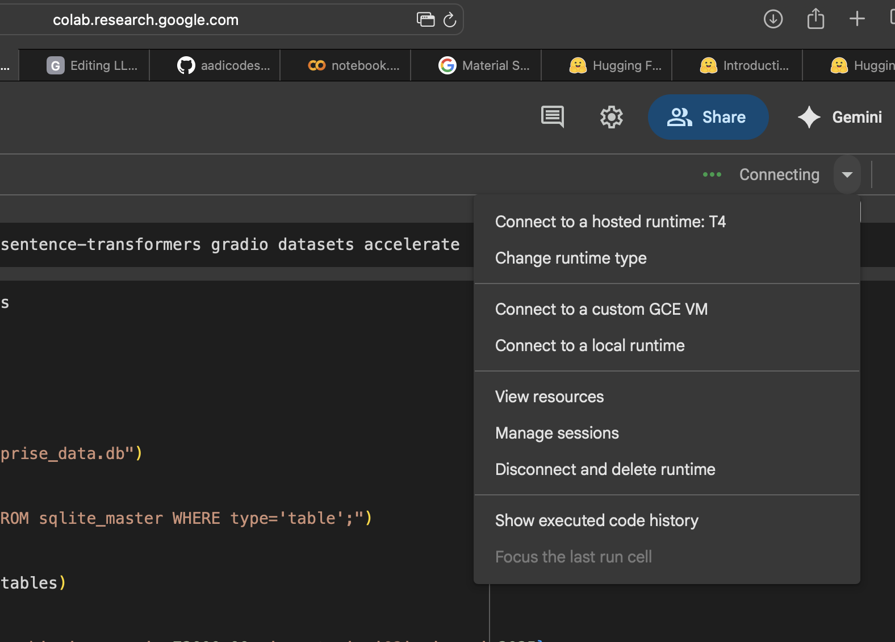
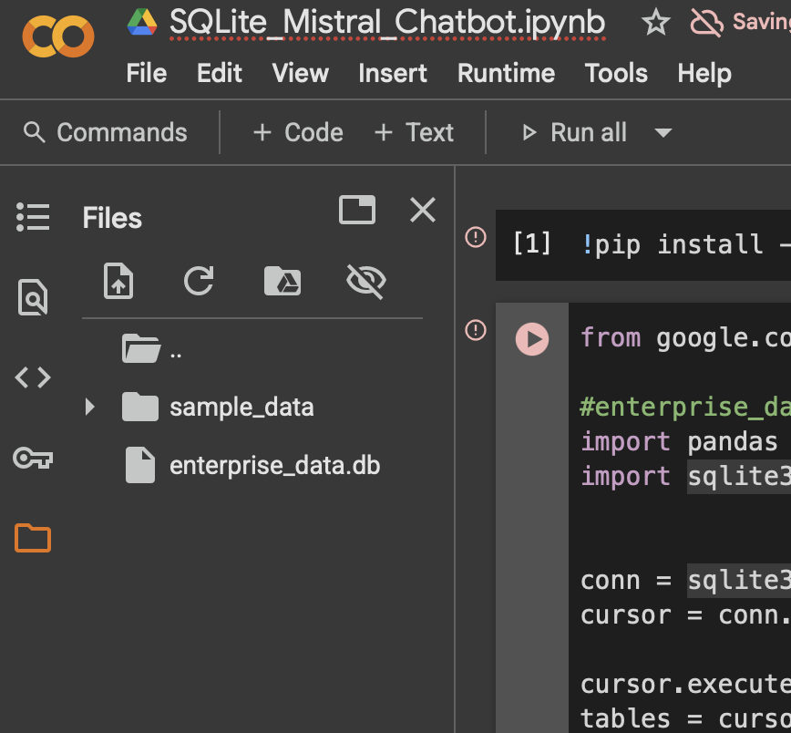

# Steps to execute 
## Mistral LLM based chat bot
1. Create google colab account if dont have one at, https://colab.research.google.com/

2. Open SQLite_Mistral_Chatbot.ipynb Jupyter notebook file i Google Colab
3. Drag the enterprise_data.db file to Google Colab Folder.
4. Change Runtime Type from Menu as shown below
5. Set Runtime Type to Pyhton 3, and Hardware Accelerator to T4 GPU (its free)

6. Click Save.
7. Select Run All Menu option as shown below picture.

8. You will see the Chatbot ready to take questions as shown below.

9. You may ask this question to find the answer that is pulled from the SQLite database.
```
What's the Q3 2025 revenue at Phoenix  branch? 
```
